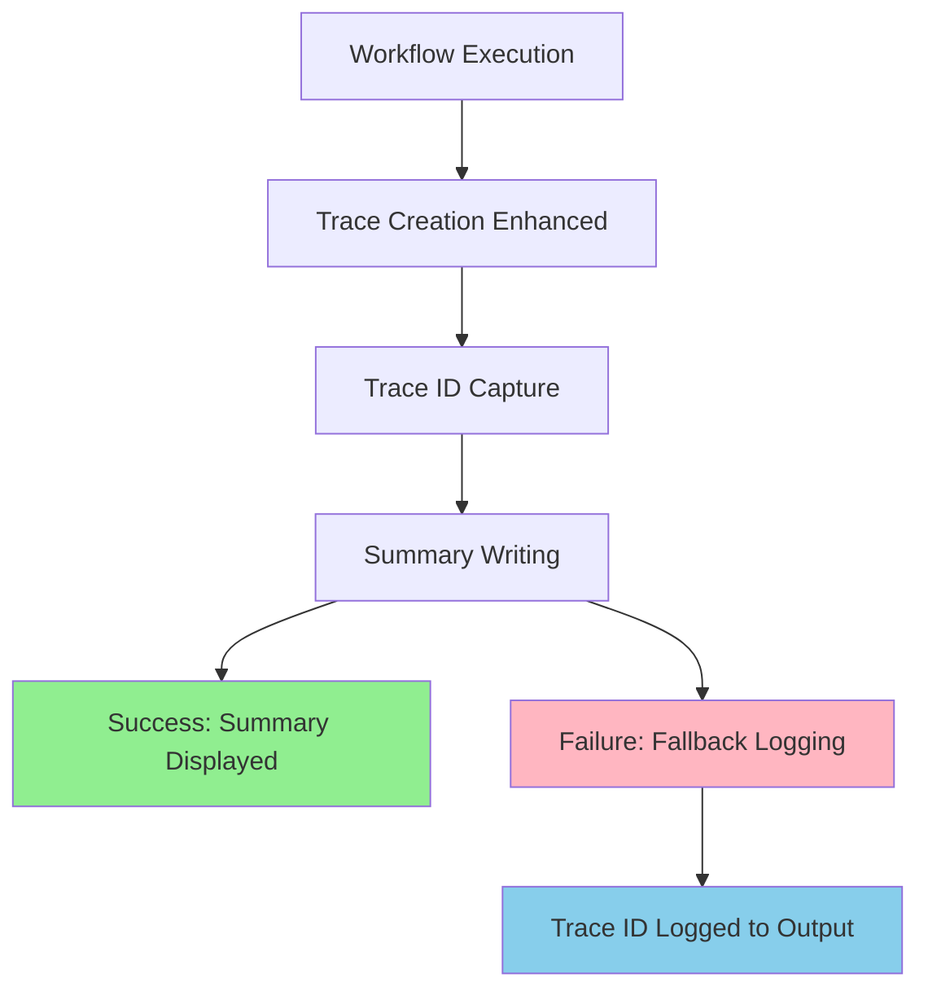

# Design Document: Trace ID Summary

## Overview

The trace ID summary feature enhances the GitHub Actions OpenTelemetry action by
displaying workflow trace IDs in the GitHub Actions summary after execution
completes. This provides immediate visibility into trace identifiers, enabling
users to quickly correlate workflow execution with traces in their observability
systems.

The feature integrates seamlessly with the existing OpenTelemetry workflow by
capturing the trace ID during trace creation and writing it to the GitHub
Actions summary using the GitHub Actions API.

## Architecture

### High-Level Flow

1. **Trace Creation**: During normal workflow execution, the OpenTelemetry
   instrumentation creates a workflow trace
2. **Trace ID Capture**: The trace ID is captured and stored during trace
   creation
3. **Summary Generation**: After trace creation completes, the trace ID is
   formatted and written to the GitHub Actions summary
4. **Error Handling**: If summary writing fails, the trace ID is logged as
   fallback output

### Integration Points

- **Existing Trace Module**: Extends `src/traces/create-trace.ts` to capture and
  return trace ID
- **GitHub Actions API**: Uses `@actions/core` to write to the workflow summary
- **Main Orchestration**: Integrates into `src/main.ts` workflow after trace
  creation

## Components and Interfaces

### Core Components

#### 1. Trace ID Capture Enhancement

**Location**: `src/traces/create-trace.ts`

```typescript
interface TraceResult {
  traceId: string
  success: boolean
}

export async function createTrace(settings: Settings): Promise<TraceResult>
```

**Rationale**: Modify existing trace creation to return the trace ID alongside
success status, maintaining backward compatibility while enabling trace ID
access.

#### 2. Summary Writer Module

**Location**: `src/github/summary.ts`

```typescript
interface SummaryOptions {
  traceId: string
  label?: string
}

export async function writeSummary(options: SummaryOptions): Promise<void>
```

**Rationale**: Create a dedicated module for summary operations to maintain
separation of concerns and enable easy testing.

#### 3. Main Orchestration Update

**Location**: `src/main.ts`

Integration point that coordinates trace creation and summary writing while
handling errors gracefully.

### Data Flow



## Data Models

### Trace Result Model

```typescript
interface TraceResult {
  traceId: string // Full OpenTelemetry trace ID
  success: boolean // Indicates if trace creation succeeded
}
```

### Summary Configuration

```typescript
interface SummaryConfig {
  traceId: string // Required trace ID to display
  label: string // Display label (default: "Workflow Trace")
  fallbackToLog: boolean // Whether to log on summary failure (default: true)
}
```

**Rationale**: Simple, focused data models that capture only the essential
information needed for trace ID display while providing configuration
flexibility.

## Error Handling

### Summary Writing Failures

- **Primary Strategy**: Graceful degradation - action continues successfully
  even if summary writing fails
- **Fallback Strategy**: Log trace ID to action output using
  `@actions/core.info()`
- **Rate Limiting**: Handle GitHub API rate limits with appropriate error
  messages

### Trace ID Unavailability

- **No Trace Created**: Display informative message in summary indicating no
  trace was generated
- **Invalid Trace ID**: Log error and skip summary writing to prevent action
  failure

### Implementation Strategy

```typescript
try {
  await writeSummary({ traceId, label: 'Workflow Trace' })
} catch (error) {
  core.info(`Trace ID: ${traceId}`)
  core.warning(`Failed to write summary: ${error.message}`)
}
```

**Rationale**: Non-intrusive error handling ensures the core OpenTelemetry
functionality remains unaffected while providing multiple ways to access trace
information.

## Testing Strategy

### Unit Tests

- **Trace ID Capture**: Verify trace creation returns valid trace ID
- **Summary Writing**: Test summary formatting and GitHub API integration
- **Error Scenarios**: Test graceful handling of API failures and invalid inputs

### Mocking Strategy

- **GitHub API**: Mock `@actions/core` for unit tests
- **OpenTelemetry**: Use existing trace mocking infrastructure

**Rationale**: Focused unit testing strategy ensures reliability while keeping
maintenance costs reasonable for this non-core feature.

## Implementation Considerations

### Performance Impact

- **Minimal Overhead**: Summary writing occurs after main trace creation, adding
  negligible execution time
- **Async Operations**: All summary operations are non-blocking and don't affect
  core functionality

### Security

- **Trace ID Exposure**: Trace IDs are not sensitive information and are safe to
  display in GitHub Actions summaries
- **API Permissions**: Uses existing GitHub Actions token permissions for
  summary writing

### Backward Compatibility

- **Existing Workflows**: No changes to existing trace creation behavior
- **Optional Feature**: Summary writing is additive and doesn't modify core
  OpenTelemetry functionality

### Configuration

- **No New Settings**: Feature works with existing configuration
- **Environment Variables**: Leverages existing GitHub Actions environment for
  API access

**Rationale**: Design prioritizes simplicity and non-intrusiveness to ensure the
feature enhances observability without impacting existing functionality or
requiring additional configuration.
