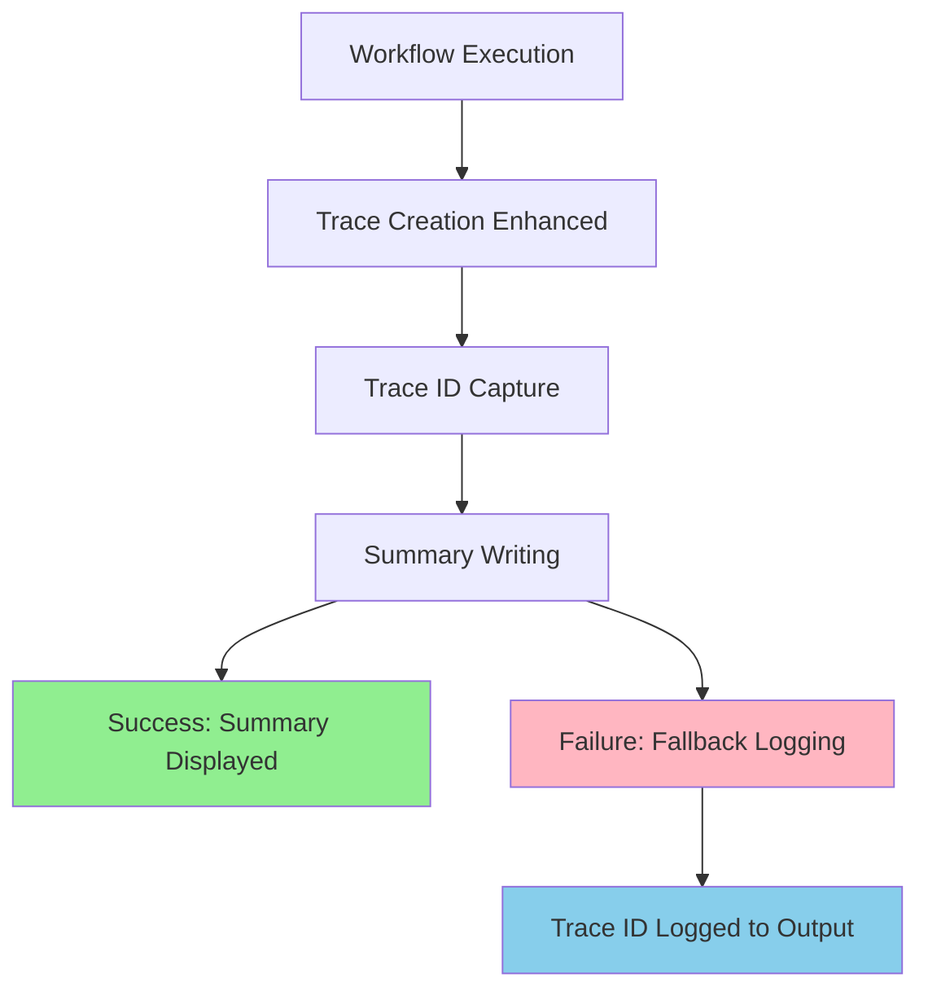

# Design Document: Trace ID Summary

## Overview

The trace ID summary feature enhances the GitHub Actions OpenTelemetry action by
displaying workflow trace IDs in the GitHub Actions summary after execution
completes. This provides immediate visibility into trace identifiers, enabling
users to quickly correlate workflow execution with traces in their observability
systems.

The feature integrates seamlessly with the existing OpenTelemetry workflow by
capturing the trace ID during trace creation and writing it to the GitHub
Actions summary using the GitHub Actions API.

## Architecture

### High-Level Flow

1. **Trace Creation**: During normal workflow execution, the OpenTelemetry
   instrumentation creates a workflow trace
2. **Trace ID Capture**: The trace ID is captured and stored during trace
   creation
3. **Summary Generation**: After trace creation completes, the trace ID is
   formatted and written to the GitHub Actions summary
4. **Error Handling**: If summary writing fails, the trace ID is logged as
   fallback output

### Integration Points

- **Existing Trace Module**: Extends `src/traces/create-trace.ts` to capture and
  return trace ID
- **GitHub Actions API**: Uses `@actions/core` to write to the workflow summary
- **Main Orchestration**: Integrates into `src/main.ts` workflow after trace
  creation

## Components and Interfaces

### Core Components

#### 1. Trace ID Capture Enhancement

**Location**: `src/traces/create-trace.ts`

```typescript
export async function createTrace(settings: Settings): Promise<string>
```

**Rationale**: Modify existing trace creation to return the trace ID directly as
a string. If trace creation fails or no trace ID is available, return an empty
string. This simplifies the interface and removes the need for complex result
objects.

#### 2. Summary Writer Module

**Location**: `src/github/summary.ts`

```typescript
interface SummaryOptions {
  traceId: string
}

export async function writeSummary(options: SummaryOptions): Promise<void>
```

**Rationale**: Create a dedicated module for summary operations to maintain
separation of concerns and enable easy testing. Uses a fixed label to simplify
the interface. The base `writeSummary` function handles the core functionality.

#### 3. Conditional Summary Writer

**Location**: `src/github/summary.ts`

```typescript
export async function writeSummaryIfNeeded(traceId: string): Promise<void>
```

**Rationale**: Create a high-level function that handles all summary logic
including error handling and fallback logging. If traceId is empty, displays "No
trace ID was generated" message. Otherwise, displays the trace ID normally.

### Data Flow



## Data Models

### Summary Configuration

```typescript
interface SummaryOptions {
  traceId: string // Trace ID to display (empty string if no trace available)
}
```

**Rationale**: Simplified data model that only captures the trace ID. Empty
string indicates no trace was created, which triggers a specific message
display. The TraceResult interface has been removed to simplify the
architecture.

## Error Handling

### Summary Writing Failures

- **Primary Strategy**: Graceful degradation - action continues successfully
  even if summary writing fails
- **Fallback Strategy**: Log trace ID to action output using
  `@actions/core.info()`
- **Rate Limiting**: Handle GitHub API rate limits with appropriate error
  messages

### Trace ID Unavailability

- **No Trace Created**: When trace ID is empty string, display "No trace ID was
  generated" message in summary
- **Valid Trace ID**: When trace ID is not empty, display the trace ID normally
  with "Workflow Trace" label

### Implementation Strategy

```typescript
try {
  if (traceId === '') {
    // Display message when no trace ID is available
    await writeSummary({ traceId: 'No trace ID was generated' })
  } else {
    // Display actual trace ID
    await writeSummary({ traceId })
  }
} catch (error) {
  // Fallback to logging
  if (traceId !== '') {
    core.info(`Trace ID: ${traceId}`)
  } else {
    core.info('No trace ID was generated')
  }
  core.warning(`Failed to write summary: ${error.message}`)
}
```

**Rationale**: Simplified error handling that checks for empty trace ID and
displays appropriate messages. Removes the need for complex result objects while
maintaining clear user feedback when no trace ID is available.

## Testing Strategy

### Unit Tests

- **Trace ID Capture**: Verify trace creation returns valid trace ID
- **Summary Writing**: Test summary formatting and GitHub API integration
- **Error Scenarios**: Test graceful handling of API failures and invalid inputs

### Mocking Strategy

- **GitHub API**: Mock `@actions/core` for unit tests
- **OpenTelemetry**: Use existing trace mocking infrastructure

**Rationale**: Focused unit testing strategy ensures reliability while keeping
maintenance costs reasonable for this non-core feature.

## Implementation Considerations

### Performance Impact

- **Minimal Overhead**: Summary writing occurs after main trace creation, adding
  negligible execution time
- **Async Operations**: All summary operations are non-blocking and don't affect
  core functionality

### Security

- **Trace ID Exposure**: Trace IDs are not sensitive information and are safe to
  display in GitHub Actions summaries
- **API Permissions**: Uses existing GitHub Actions token permissions for
  summary writing

### Backward Compatibility

- **Existing Workflows**: No changes to existing trace creation behavior
- **Optional Feature**: Summary writing is additive and doesn't modify core
  OpenTelemetry functionality

### Configuration

- **No New Settings**: Feature works with existing configuration
- **Environment Variables**: Leverages existing GitHub Actions environment for
  API access

## Documentation Strategy

### README Updates

The main README.md will be enhanced to include:

- **Feature Overview**: Clear explanation of the trace ID summary functionality
- **Visual Examples**: Screenshots or code blocks showing what the summary looks
  like in GitHub Actions
- **Usage Instructions**: How to interpret and use the displayed trace ID
- **Integration Guide**: How to correlate trace IDs with monitoring systems like
  Jaeger, Grafana, etc.

### Documentation Structure

```markdown
## Trace ID Summary

After the action completes, you'll see the workflow trace ID in the GitHub
Actions summary:
```

Workflow Trace ID: 1234567890abcdef1234567890abcdef

```

Use this trace ID to search for the corresponding trace in your monitoring system.
```

**Rationale**: Design prioritizes simplicity and non-intrusiveness to ensure the
feature enhances observability without impacting existing functionality or
requiring additional configuration. Comprehensive documentation ensures users
can effectively leverage the trace ID summary feature.
