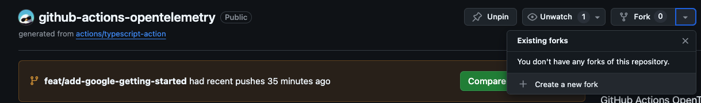
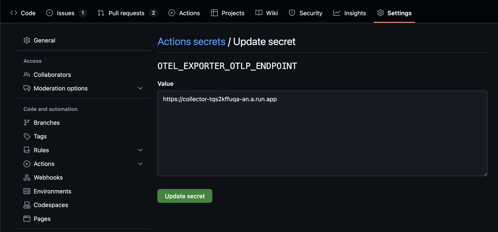
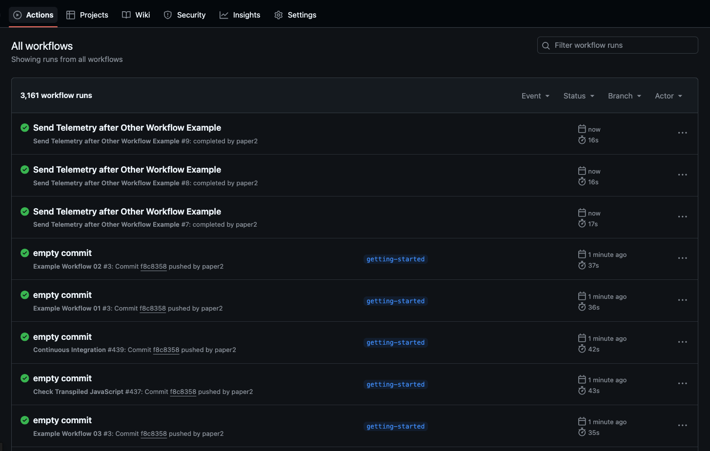
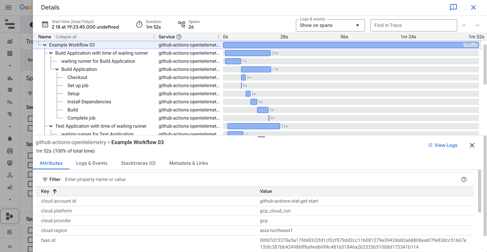
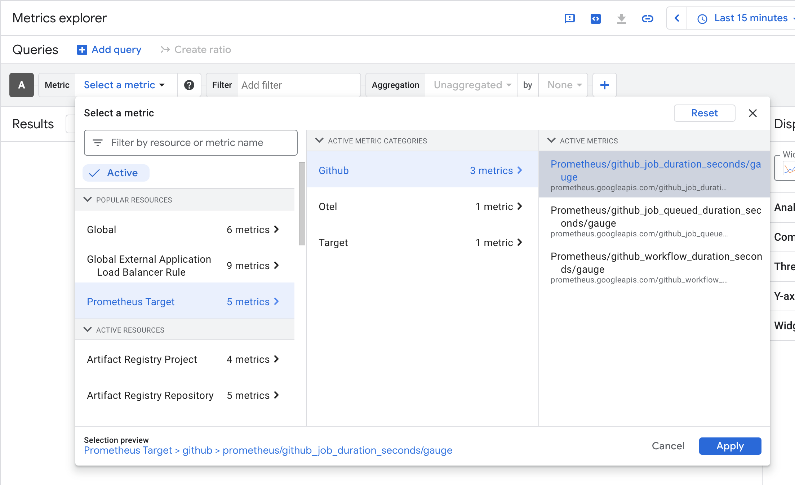
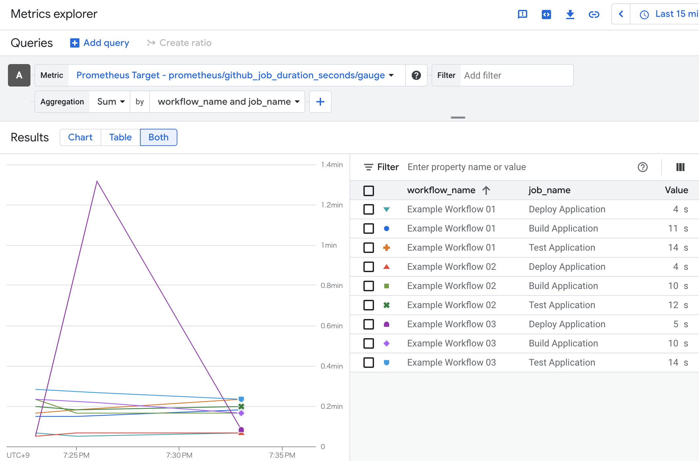

# Getting Started on Google Cloud

このGetting Startedでは、Google CloudのCloud Run上でOpenTelemetry
Collectorをデプロイし、github-actions-opentelemetryを使ってGitHub
ActionsのワークフローからOTLPでトレースとメトリクスをGoogle
Cloudに送信する方法を説明します。

## 前提条件

- Google Cloudプロジェクト
- gcloud cliのインストール

## gcloudのデフォルトを設定する

1. デフォルトのプロジェクトを設定します。

   ```sh
   gcloud config set project <PROJECT_ID>
   ```

   <PROJECT_ID> は、Google CloudプロジェクトのIDです。

1. デフォルトのリージョンを設定します。

   ```sh
   gcloud config set run/region <REGION>
   ```

   <REGION> は、Cloud Runのリージョンです。 例: `asia-northeast1`

## サンプルコードをクローンする

サンプルコードをクローンし、ディレクトリに移動します。

```sh
git clone https://github.com/paper2/github-actions-opentelemetry.git
cd github-actions-opentelemetry/examples/google-cloud
```

## OpenTelemetryコレクターをCloud Runにデプロイする

```sh
  gcloud run deploy collector \
  --source . \
  --allow-unauthenticated \
  --port=4318 \
  --max-instances=3
```

> [!NOTE] 本番環境などではCloud
> Runの未認証アクセスを許可しないことをお勧めします。

上記コマンドでは[Dockerfile](./Dockerfile)を使ってコンテナをビルドし、OpenTelemetryコレクターをCloud
Runにデプロイします。[Contrib repository for the OpenTelemetry Collector](https://github.com/open-telemetry/opentelemetry-collector-contrib)をベースイメージにしており、[collector-config.yaml](./collector-config.yaml)を設定ファイルとして使用しています。

設定ファイルではOTLPのエンドポイントに送られたテレメトリをCloud TraceとCloud
Monitoringに送信するように設定しています。これによりOTLPを受け付けるコレクターがデプロイできました。

## Github Actions OpenTelemetryのリポジトリをフォークする

サンプルのワークフローを動かすために[github-actions-opentelemetry](https://github.com/paper2/github-actions-opentelemetry)をフォークします。



## OTLPのエンドポイントを設定する

以下のコマンドでOpenTelemetryコレクターのCloud Runのエンドポイントを取得します。

```sh
gcloud run services describe collector --format 'value(status.url)'
```

[レポジトリシークレット](https://docs.github.com/en/actions/security-for-github-actions/security-guides/using-secrets-in-github-actions#creating-secrets-for-a-repository)に
`OTEL_EXPORTER_OTLP_ENDPOINT` というキーで取得したエンドポイントを設定します。



## getting-startedブランチを作成する

ローカルにフォークしたリポジトリをクローンし、getting-startedブランチを作成します。

```sh
git clone <YOUR_FORKED_REPOSITORY>
git switch -c getting-started
```

## ワークフローを実行する

getting-startedブランチにコミットし、リモートリポジトリにプッシュします。

```sh
git commit --allow-empty -m "empty commit"
git push --set-upstream origin getting-started
```

Actionsタブからワークフローの実行を確認します。
[Example Workflow](../../.github/workflows/example-workflow-01.yml) が成功すると
[Send Telemetry after Other Workflow Example](../../.github/workflows/example-run-action.yml)
が実行されます。ワークフローによりgithub-actions-opentelemetryが動作し、トレースとメトリクスがOTLPエンドポイントに送信されます。



成功していることが確認できたらメトリクスの変化を確認するため再びコミットし、リモートリポジトリにプッシュしてください。

```sh
git commit --allow-empty -m "empty commit"
git push
```

[Send Telemetry after Other Workflow Example](../../.github/workflows/example-run-action.yml)は以下のようになっています。

```yaml
name: Send Telemetry after Other Workflow Example

on:
  workflow_run:
    # Specify the workflows you want to collect telemetry.
    workflows:
      - Example Workflow 01
      - Example Workflow 02
      - Example Workflow 03
    types:
      - completed

permissions:
  # Required for private repositories
  actions: read

jobs:
  send-telemetry:
    name: Send CI Telemetry
    runs-on: ubuntu-latest
    steps:
      - name: Run
        id: run
        uses: paper2/github-actions-opentelemetry@main
        env:
          OTEL_EXPORTER_OTLP_ENDPOINT:
            ${{ secrets.OTEL_EXPORTER_OTLP_ENDPOINT }}
          OTEL_SERVICE_NAME: github-actions-opentelemetry
        with:
          GITHUB_TOKEN: ${{ secrets.GITHUB_TOKEN }}
```

workflow_runは指定したワークフローが完了したときにトリガーされます。github-actions-opentelemetryは完了したワークフローの情報を収集し、トレースとメトリクスをOTLPエンドポイントに送信します。

## Cloud Traceでトレースを確認する

ワークフローの `run_id` を取得します。 `run_id`
はワークフロー実行結果のURLに含まれています。

例えば以下のURLであれば、 `run_id` は `13388380812` です。

```
https://github.com/paper2/github-actions-opentelemetry/actions/runs/13388380812
```

[Trace Explorer](https://console.cloud.google.com/traces/explorer)を開き、フィルタで
`run_id` を指定します。


Span IDのリンクを押下するとトレースを確認できます。



## Metrics Explorerでメトリクスを確認する

[Metrics Explorer](https://console.cloud.google.com/monitoring/metrics-explorer)を開き、
`prometheus/github_job_duration_seconds/gauge` メトリクスを選択します。



グループに `workflow_name` と `job_name`
を指定すると、ワークフローとジョブごとの実行時間を確認することができます。



## 片付け

コレクターのcloud runを削除します。

```sh
gcloud run services delete collector
```

gcloudのデフォルト設定を削除します。

```sh
gcloud config unset project
gcloud config unset run/region
```
