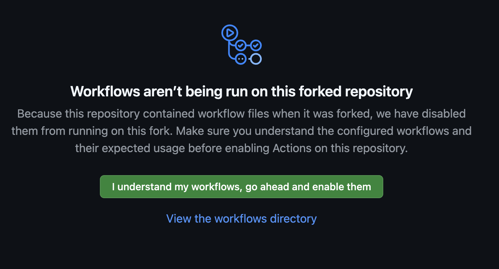

# Getting Started on Google Cloud

## Overview

This guide explains how to deploy an OpenTelemetry Collector on Google Cloud
Cloud Run and how to use `github-actions-opentelemetry` to send traces and
metrics from GitHub Actions workflows to Google Cloud via the OpenTelemetry
Protocol (OTLP).

> [!IMPORTANT]  
> `github-actions-opentelemetry` works with any OTLP endpoint. It can also be
> used outside of Google Cloud.

## Prerequisites

- A Google Cloud project
- The `gcloud` CLI installed
- A GitHub account

## Step 1: Configure Default gcloud Settings

1. **Set the default project**:

   ```sh
   gcloud config set project <PROJECT_ID>
   ```

   Replace `<PROJECT_ID>` with your Google Cloud project ID.

2. **Set the default region**:

   ```sh
   gcloud config set run/region <REGION>
   ```

   Replace `<REGION>` with your desired Cloud Run region (for example,
   `asia-northeast1`).

## Step 2: Fork the GitHub Actions OpenTelemetry Repository

To run the sample GitHub Actions workflow, fork the
[`github-actions-opentelemetry`](https://github.com/paper2/github-actions-opentelemetry)
repository.


## Step 3: Clone the Sample Code

Clone your forked repository to your local machine and navigate to the
`google-cloud` example directory:

```sh
git clone https://<YOUR_FORKED_REPOSITORY>
cd github-actions-opentelemetry/examples/google-cloud
```

## Step 4: Deploy the OpenTelemetry Collector to Cloud Run

Deploy the collector using the following command:

```sh
gcloud run deploy collector \
  --source . \
  --allow-unauthenticated \
  --port=4318 \
  --max-instances=3
```

> [!NOTE]  
> In a production environment, it is recommended that you do not allow
> unauthenticated access to Cloud Run.

This command uses the [Dockerfile](./Dockerfile) to build a container and deploy
the OpenTelemetry Collector to Cloud Run. The container is based on the
[OpenTelemetry Collector Contrib repository](https://github.com/open-telemetry/opentelemetry-collector-contrib)
and uses [collector-config.yaml](./collector-config.yaml) as its configuration
file.

The configuration file is set up to receive telemetry via OTLP and forward it to
Cloud Trace and Cloud Monitoring. This means you now have a collector that can
accept OTLP data.

## Step 5: Set the OTLP Endpoint

Retrieve the Cloud Run endpoint for the OpenTelemetry Collector:

```sh
gcloud run services describe collector --format 'value(status.url)'
```

Copy the resulting URL and add it as a
[repository secret](https://docs.github.com/en/actions/security-for-github-actions/security-guides/using-secrets-in-github-actions#creating-secrets-for-a-repository)
named `OTEL_EXPORTER_OTLP_ENDPOINT`.


## Step 6: Enable Workflow Runs

Open the **Actions** tab in your forked repository. You should see a message
asking if you want to enable workflows. Review them and enable this feature.



## Step 7: Run the Workflow

Create and push a new branch named `getting-started`:

```sh
git switch -c getting-started
git commit --allow-empty -m "empty commit"
git push --set-upstream origin getting-started
```

In the **Actions** tab, verify that the
[Example Workflow](../../.github/workflows/example-workflow-01.yml) completes
successfully. Afterward, the
[Send Telemetry after Other Workflow Example](../../.github/workflows/example-run-action.yml)
runs and uses `github-actions-opentelemetry` to send traces and metrics to the
OTLP endpoint.

Once you confirm that the workflow completes, make another commit to observe
changes in the metrics:

```sh
git commit --allow-empty -m "empty commit"
git push
```

The
[Send Telemetry after Other Workflow Example](../../.github/workflows/example-run-action.yml)
is below.

```yaml
name: Send Telemetry after Other Workflow Example

on:
  workflow_run:
    # Specify the workflows you want to collect telemetry from.
    workflows:
      - Example Workflow 01
      - Example Workflow 02
      - Example Workflow 03
    types:
      - completed

permissions:
  # Required for private repositories
  actions: read

jobs:
  send-telemetry:
    name: Send CI Telemetry
    runs-on: ubuntu-latest
    steps:
      - name: Run
        id: run
        uses: paper2/github-actions-opentelemetry@main
        env:
          OTEL_EXPORTER_OTLP_ENDPOINT:
            ${{ secrets.OTEL_EXPORTER_OTLP_ENDPOINT }}
          OTEL_SERVICE_NAME: github-actions-opentelemetry
        with:
          GITHUB_TOKEN: ${{ secrets.GITHUB_TOKEN }}
```

Whenever any of the specified workflows complete, the `workflow_run` event
triggers this job. `github-actions-opentelemetry` then gathers workflow details
and sends traces and metrics to the specified OTLP endpoint.

## Step 8: Check Cloud Trace for Traces

To find traces, identify the `run_id` from the Example Workflow. The `run_id` is
visible in the workflow results URL. For example, if the URL is:

```txt
https://github.com/paper2/github-actions-opentelemetry/actions/runs/13388380812
```

Then the `run_id` is `13388380812`.

Open the [Trace Explorer](https://console.cloud.google.com/traces/explorer) and
filter by `run_id`.


Select a **Span ID** link to view detailed trace information.


## Step 9: Check Cloud Monitoring for Metrics

Open the
[Metrics Explorer](https://console.cloud.google.com/monitoring/metrics-explorer)
and select the metric:

```txt
prometheus/github_job_duration_seconds/gauge
```

Configure the **Aggregation** settings to group by `workflow_name` and
`job_name` to see execution times for each workflow and job.


## Step 10: Clean Up

To remove the Cloud Run service:

```sh
gcloud run services delete collector
```

Then reset your gcloud configuration:

```sh
gcloud config unset project
gcloud config unset run/region
```

Finally, delete your forked repository if you no longer need it.
