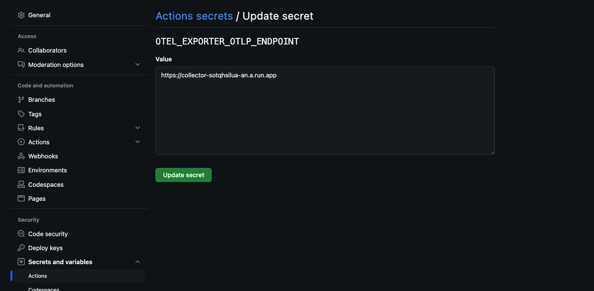

# Getting Started on Google Cloud

このGetting Startedでは、Google CloudのCloud Run上でOpenTelemetry
Collectorをデプロイし、github-actions-opentelemetryを使ってGitHub
ActionsのワークフローからOTLPでトレースとメトリクスをGoogle
Cloudに送信する方法を説明します。

## 前提条件

- Google Cloudプロジェクト
  - APIの有効化（Cloud Run, Cloud Trace, Cloud Monitoring） #
    TODO: サービスの見直しとlink作成
- gcloud cliのインストール

## gcloudのデフォルトを設定する

1. デフォルトのプロジェクトを設定します。

   ```sh
   gcloud config set project <PROJECT_ID>
   ```

   <PROJECT_ID> は、Google CloudプロジェクトのIDです。

1. デフォルトのリージョンを設定します。

   ```sh
   gcloud config set run/region <REGION>
   ```

   <REGION> は、Cloud Runのリージョンです。 例: `asia-northeast1`

## サンプルコードをクローンする

サンプルコードをクローンし、ディレクトリに移動します。

```sh
git clone https://github.com/paper2/github-actions-opentelemetry.git
cd github-actions-opentelemetry/examples/google-cloud
```

## OpenTelemetryコレクターをCloud Runにデプロイする

> [!NOTE] 検証以外ではCloud Runの未認証アクセスを許可しないことをお勧めします。

```sh
  gcloud run deploy collector \
  --source . \
  --allow-unauthenticated \
  --port=4318 \
  --max-instances=3
```

上記コマンドでは[Dockerfile](./Dockerfile)を使ってコンテナをビルドし、OpenTelemetryコレクターをCloud
Runにデプロイします。[Contrib repository for the OpenTelemetry Collector](https://github.com/open-telemetry/opentelemetry-collector-contrib)をベースイメージにしており、[collector-config.yaml](./collector-config.yaml)を設定ファイルとして使用しています。

設定ファイルではOTLPのエンドポイントに送られたテレメトリをCloud TraceとCloud
Monitoringに送信するように設定しています。これによりOTLPを受け付けるコレクターがデプロイできました。

## Github Actions OpenTelemetryのリポジトリをフォークする

サンプルのワークフローを動かすために[github-actions-opentelemetry](https://github.com/paper2/github-actions-opentelemetry)をフォークします。


## OTLPのエンドポイントを設定する

以下のコマンドでOpenTelemetryコレクターのCloud Runのエンドポイントを取得します。

```sh
gcloud run services describe collector --format 'value(status.url)'
```

[レポジトリシークレット](https://docs.github.com/en/actions/security-for-github-actions/security-guides/using-secrets-in-github-actions#creating-secrets-for-a-repository)に
`OTEL_EXPORTER_OTLP_ENDPOINT` というキーで取得したエンドポイントを設定します。



## getting-startedブランチを作成する

ローカルにフォークしたリポジトリをクローンし、getting-startedブランチを作成します。

```sh
git clone <YOUR_FORKED_REPOSITORY>
git switch -c getting-started
```

## ワークフローを実行する

getting-startedブランチにコミットし、リモートリポジトリにプッシュします。

```sh
git commit --allow-empty -m "empty commit"
git push origin getting-started
```

- empty commitをしてpush
  - example workflowとsend metricsが成功することを確認
- 確認が終わったらempty commitをしてpush(metricsの差分を見るため)
  - example workflowとsend metricsが動く
- トレースの確認
  - send metricsのトレースIDで検索
- empty commitをしてpush(metricsの差分を見るため)
  - example workflowとsend metricsが動く
- Metrics Exploerで確認
- clean up

  - cloud runの削除
  - デフォルト設定のunset
  - https://cloud.google.com/run/docs/tutorials/custom-metrics-opentelemetry-sidecar?hl=ja#review-code

- how to work

  - これはgetting startedじゃないな。別で書くか

```

```
